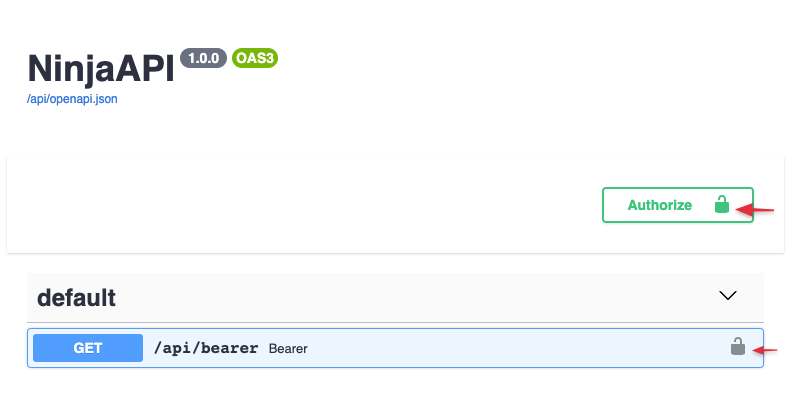

# Authentication

## Intro

**Django Ninja** provides several tools to help you deal with authentication and authorization easily, rapidly, in a standard way, without having to study and learn <a href="https://swagger.io/docs/specification/authentication/" target="_blank">all the security specifications</a>.

The core concept is that when you describe api operation you can define authentication object

```Python hl_lines="2 7"
{!./src/tutorial/authentication/code001.py!}
```

In this example client will be able to call `pets` method only if uses django session authentication (default is cookie based). Otherwise, a HTTP-401 error will be returned.

## Automatic Openapi schema

Let's create an example where client in order to authenticate needs to pass a header :

`Authorization: Bearer supersecret`

```Python hl_lines="4 5 6 7 10"
{!./src/tutorial/authentication/bearer01.py!}
```

Now go to docs at <a href="http://localhost:8000/api/docs" target="_blank">http://localhost:8000/api/docs</a>:




When you click **Authorize** button you will get a prompt to input your authentication token


Now if you do test calls - the Authorization header will passed for every request.


## Global authentication 

In case you need to secure **all** methods of your api - you can pass `auth` argument to a `NinjaAPI` constructor:


```Python hl_lines="11 19"
from ninja import NinjaAPI, Form
from ninja.security import HttpBearer


class GlobalAuth(HttpBearer):
    def authenticate(self, request, token):
        if token == "supersecret":
            return token


api = NinjaAPI(auth=GlobalAuth())

# @api.get(...)
# def ...

# @api.post(...)
# def ...
```

And if you need to overrule some those methods—you can do that on the operation level again by passing `auth` argument. In this example authentication will be disabled for `/token` operation:

```Python hl_lines="19"
{!./src/tutorial/authentication/global01.py!}
```

## Available auth options

### Custom function


The "`auth=`" argument accepts any Callable object. **NinjaAPI** passes authentication only if callable object returns a **not None** value. This return value will be assigned to `request.auth` attribute.

```Python hl_lines="1 2 3 6"
{!./src/tutorial/authentication/code002.py!}
```


### API Key

Some APIs use API keys for authorization. An API key is a token that a client provides when making API calls. The key can be sent in the query string:
```
GET /something?api_key=abcdef12345
```

or as a request header:

```
GET /something HTTP/1.1
X-API-Key: abcdef12345
```

or as a cookie:

```
GET /something HTTP/1.1
Cookie: X-API-KEY=abcdef12345
```

Django Ninja comes with builtin classes to help you handle these cases.


#### in Query

```Python hl_lines="1 2 5 6 7 8 9 10 11 12"
{!./src/tutorial/authentication/apikey01.py!}
```

In this example we take a token from `GET['api_key']` and find a `Client` in database that corresponds to this key. The Client instance will be set to `request.auth` attribute

Note: **`param_name`** - is the name of GET parameter that will be checked for. If not set - default "`key`" will be used.


#### in Header

```Python hl_lines="1 4"
{!./src/tutorial/authentication/apikey02.py!}
```

#### in Cookie

```Python hl_lines="1 4"
{!./src/tutorial/authentication/apikey03.py!}
```


### HTTP Bearer

```Python hl_lines="1 4 5 6 7"
{!./src/tutorial/authentication/bearer01.py!}
```

### HTTP Basic Auth

```Python hl_lines="1 4 5 6 7"
{!./src/tutorial/authentication/basic01.py!}
```


## Multiple authenticators

The **`auth`** argument allows also to pass multiple authenticators:

```Python hl_lines="18"
{!./src/tutorial/authentication/multiple01.py!}
```

In this case **Django Ninja** will first check they api key `GET`, and if not set or invalid will check the `header` key. And if both invalid will raise authentication error to response.


