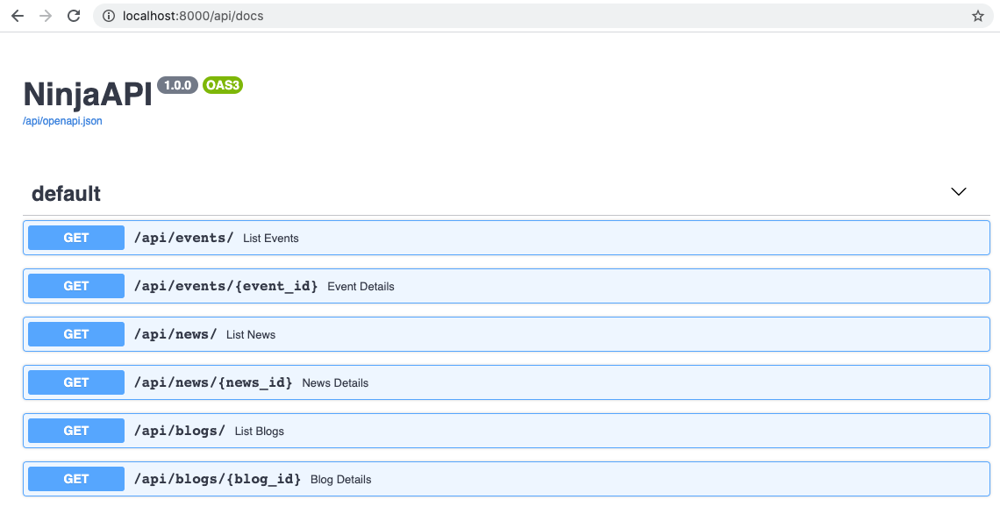

# Multiple routers

Real world applications almost never can fit all logic into a single file. 

## Simple routers

**Django Ninja** comes with an easy way to split your API into multiple modules.

Let's say you have a django project with structure like this:


```
├── myproject
│   └── settings.py
├── events/
│   ├── __init__.py
│   └── models.py
├── news/
│   ├── __init__.py
│   └── models.py
├── blogs/
│   ├── __init__.py
│   └── models.py
└── manage.py
```

To add APIs to each of the application, lets create an `api.py` module in each:

``` hl_lines="5 9 13"
├── myproject
│   └── settings.py
├── events/
│   ├── __init__.py
│   ├── api.py
│   └── models.py
├── news/
│   ├── __init__.py
│   ├── api.py
│   └── models.py
├── blogs/
│   ├── __init__.py
│   ├── api.py
│   └── models.py
└── manage.py
```

Now lets add few operations to `events/api.py`. The trick is that instead of NinjaAPI class you need to use **Router** class:

```python  hl_lines="1 4 6 13"
from ninja import Router
from .models import Event

router = Router()

@router.get('/')
def list_events(request):
    return [
        {"id": e.id, "title": e.title}
        for e in Event.objects.all()
    ]

@router.get('/{event_id}')
def event_details(request, event_id: int):
    event = Event.objects.get(id=event_id)
    return {"title": event.title, "details": event.details}
```

Then do the same for news:

```python  hl_lines="1 4"
from ninja import Router
from .models import News

router = Router()

@router.get('/')
def list_news(request):
    ...

@router.get('/{news_id}')
def news_details(request, event_id: int):
    ...
```
and blogs.


Finally let's group this together, in your project folder (next to urls.py) create another api.py file with main NinjaAPI instance:

``` hl_lines="2"
├── myproject
│   ├── api.py
│   └── settings.py
├── events/
│   ...
├── news/
│   ...
├── blogs/
│   ...

```

this will be like:

```Python
from ninja import NinjaAPI

api = NinjaAPI()

```

Now we import all the routers from apps, and include them into main api instance:

```Python hl_lines="2 3 4 8 9 10"
from ninja import NinjaAPI
from events.api import router as events_router
from news.api import router as news_router
from blogs.api import router as blogs_router

api = NinjaAPI()

api.add_router("/events/", events_router)
api.add_router("/news/", news_router)
api.add_router("/blogs/", blogs_router)
```

Now include api to your urls as usual and open your browser at `/api/docs` - you should see all your routers combined into single api:





## Nested routers

If you also wants put one router to other router to one other router, **Django Ninja** make is possible to include router into other router as many times as you like and finnaly include top router into main api instance. 

```Python
from django.contrib import admin
from django.urls import path
from .ninja import NinjaAPI, Router

api = NinjaAPI()
first_router = Router()
second_router = Router()
third_router = Router()


@api.get("/add")
def add(request, a: int, b: int):
    return {"result": a + b}


@first_router.get("/add")
def add(request, a: int, b: int):
    return {"result": a + b}


@second_router.get("/add")
def add(request, a: int, b: int):
    return {"result": a + b}


@third_router.get("/add")
def add(request, a: int, b: int):
    return {"result": a + b}


second_router.add_router("l3", third_router)
first_router.add_router("l2", second_router)
api.add_router("l1", first_router)

urlpatterns = [
    path("admin/", admin.site.urls),
    path("api/", api.urls),
]
```
